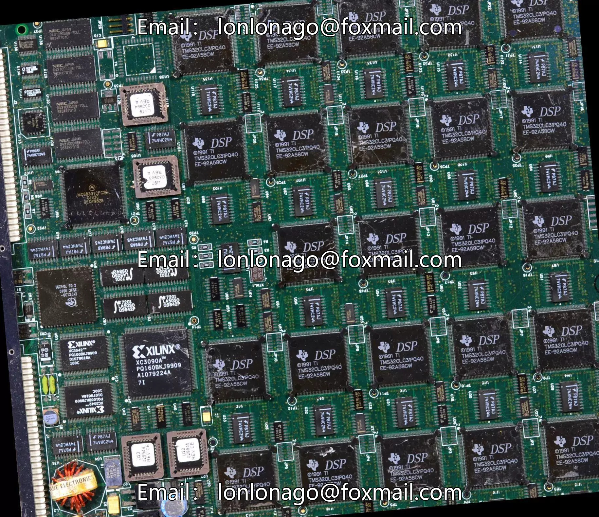
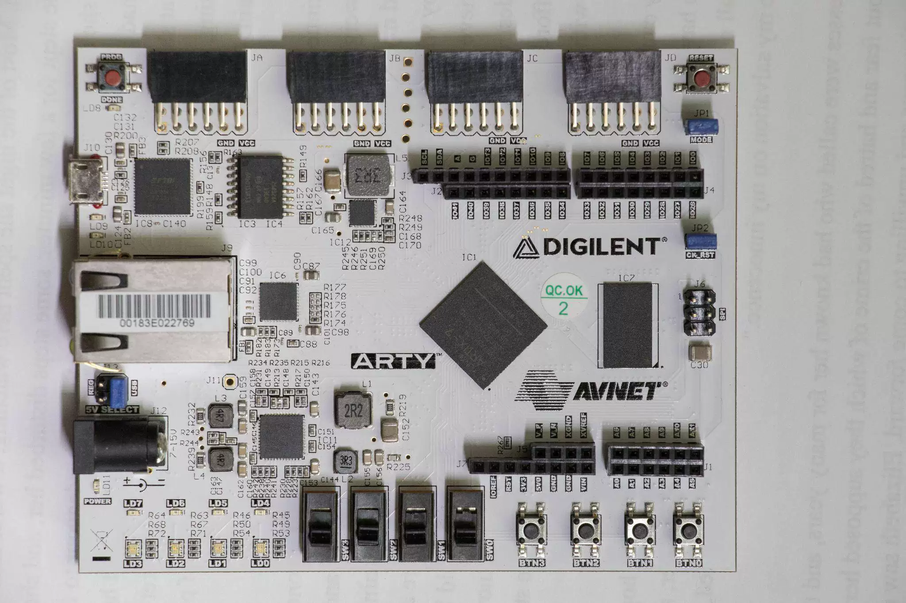
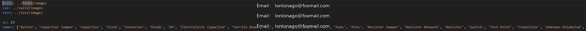

## Body

Printed Circuit Board Object Detection - YOLOv8 Dataset

Totally 1k images, each labeled separately.
Divided into 23 categories, including 'Button', 'Capacitor Jumper', 'Capacitor', 'Clock', 'Connector', 'Diode', 'EM', 'Electrolytic Capacitor', 'Ferrite Bead', 'IC', 'Inductor', 'Jumper', 'Led', 'Pads', 'Pins', 'Resistor Jumper', 'Resistor Network', 'Resistor', 'Switch', 'Test Point', 'Transistor', 'Unknown Unlabeled', 'iC'

Electronic Virtual Products are not returnable after sale.

## Images

item_1027590028075

Here is a pay link on Stripe ( https://buy.stripe.com/3cs8yP7sY87d0vu9AB ). Please contact me lonlonago@foxmail.com after funding $89, and I will send you a complete data files , thank you!

